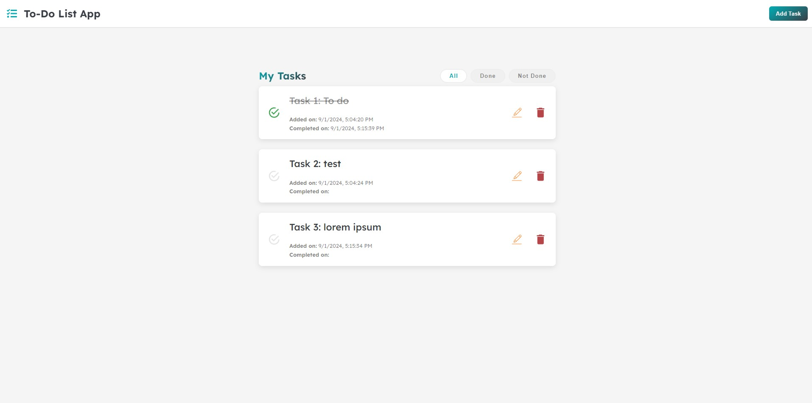

# To-Do List App



## Description

The **To-Do List App** is a simple and intuitive application built with React that helps you manage your daily tasks. The app allows users to add, edit, delete, and mark tasks as completed. It features a clean and user-friendly interface, making task management efficient and straightforward.

## Features

- **Add Tasks**: Easily add tasks with a click of a button.
- **Edit Tasks**: Modify task details as needed.
- **Delete Tasks**: Remove tasks that are no longer needed.
- **Mark as Completed**: Track your progress by marking tasks as done.
- **Filter Tasks**: View all tasks, only completed tasks, or only pending tasks.
- **Task Timestamps**: View the date when a task was added and when it was completed.

## Technologies Used

- **React**: A JavaScript library for building user interfaces.
- **CSS**: For styling the application.
- **JavaScript**: For application logic.
- **HTML**: For structuring the application.

## Demo

Check out the live demo: [To-Do List App](https://salah-todo-list.netlify.app)

## Installation

1. Clone the repository:
   ```bash
   git clone https://github.com/salahghr4/to-do-list.git
   ```
2. Navigate to the project directory:
   ```bash
   cd to-do-list
   ```
3. Install the dependencies:
   ```bash
   npm install
   ```
4. Start the development server:
   ```bash
   npm run dev
   ```

## Usage

1. Open your browser and go to `http://localhost:5173`.
2. Use the "Add Task" button to create a new task.
3. Click on the edit icon to modify an existing task.
4. Click on the delete icon to remove a task.
5. Use the filter options to view tasks based on their status.
6. Each task shows the "Added on" date, and once a task is completed, the "Completed on" date is displayed.

## Contributing

Contributions are welcome! If you have suggestions for improvements or new features, feel free to fork the repository and submit a pull request.
